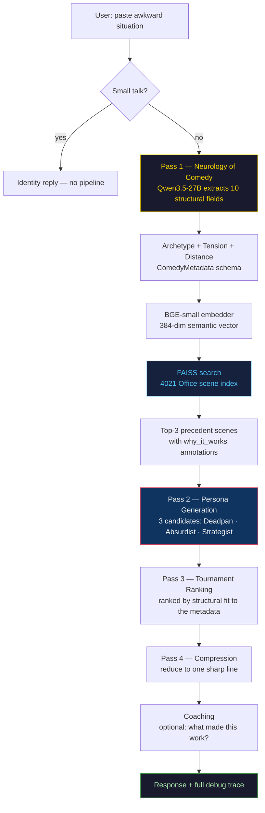
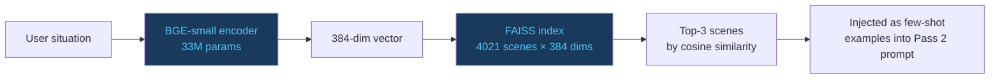
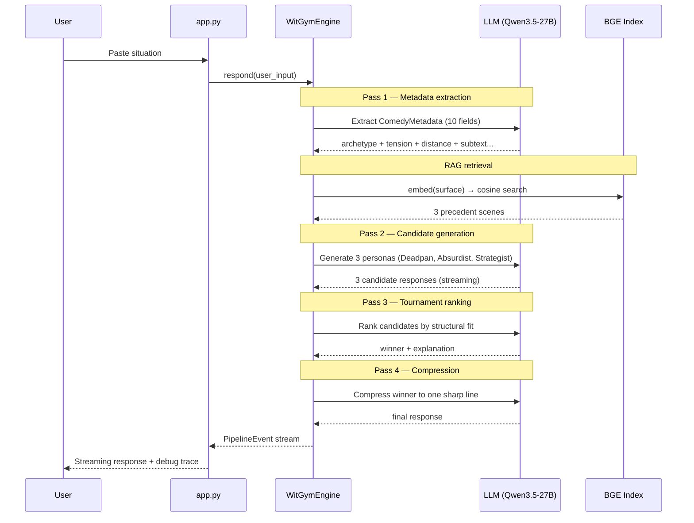

# 🎭 WitGym

> *A comedy coaching engine grounded in human precedent — not vibes.*

Paste an awkward real-life situation. WitGym dissects the **neurological structure of the moment**, retrieves analogous scenes from The Office, generates three distinct witty responses as different personas, ranks them, and explains precisely *why* the winner lands.

**[→ Try it live on Hugging Face Spaces](https://huggingface.co/spaces/build-small-hackathon/WitGym)**

---

## Why comedy is hard for AI

Every comedy coaching app just asks a model to "be funny." That's like asking someone to "be good at chess" without ever showing them a game.

Wit has **structure**. It emerges from the gap between what's socially expected and what gets said. The Office didn't write jokes — it wrote *situations*, then let characters navigate them in character-consistent ways. That's the thing to learn from.

WitGym treats comedy the way researchers do: as a system of **social violations, status games, and tension types** — then grounds responses in scenes that worked for the same reason.

---

## Architecture



---

## The Comedy Science

WitGym models comedy as three interacting structural properties:

| Property | Enum | What it captures |
|---|---|---|
| **Archetype** | `ComedyArchetype` | *Why* this moment is funny in principle — e.g. `STATUS_ASSERTION`, `SELF_DELUSION_EXPOSED`, `POWER_INVERSION` |
| **Tension type** | `TensionType` | *What* is at stake — e.g. `SOCIAL_EMBARRASSMENT`, `STATUS_THREAT`, `IDENTITY_EXPOSURE` |
| **Violation distance** | `ViolationDistance` | *How far* to push — `mild`, `moderate`, `sharp` |

These aren't vibes. They're used to:
1. Select the right **precedent scenes** from the index (cosine similarity on archetype + semantic embedding)
2. Constrain **persona generation** (each persona must violate in a structurally consistent way)
3. **Rank** candidates (the winner resolves the tension most cleanly)

The pipeline produces a `ComedyMetadata` object with 10 fields — including `connector` (the double-meaning word that makes a line land), `subtext` (what's actually being communicated), and `twist_potential` (comedy richness score 1–10 used to gate the full pipeline vs. quick response).

---

## The Retrieval System

4,021 indexed scenes from The Office, each annotated with:
- `archetype`, `tension_type`, `violation_distance` — structural labels
- `why_it_works` — a one-sentence explanation of the comedy mechanism
- `setup` + `response` — the actual scene

At query time, the user's situation is embedded with **BGE-small** (33M params) and retrieved against the index via cosine similarity. The retrieval finds scenes with the **same comedy structure** — not the same topic.



---

## Pipeline flow



---

## UI: Progressive Disclosure

The coaching panel uses a **progressive disclosure** architecture — the full debug trace is always computed, but revealed in layers:

- **Chips** (STATUS ASSERTION, STATUS THREAT, MODERATE) — tap to get a one-line definition of what that label means
- **Capsules** (SUBTEXT, POWER DYNAMIC) — tap to expand the actual analysis of your situation
- **Coaching notes** — expandable panel with the structural explanation of why the response works

New elements animate in with a shimmer sweep + border glow system that stops on first interaction. This mirrors how Notion and Apple iOS handle progressive discovery — purposeful discoverability signaling, not decoration.

---

## Tech Stack

| Layer | Choice | Why |
|---|---|---|
| **LLM** | Qwen3.5-27B via HF Inference Providers | ≤32B constraint; best instruction-following at this size |
| **Embedder** | BGE-small (33M params) | Fast, accurate, runs on CPU in < 50ms |
| **Index** | FAISS flat cosine, 4021 scenes × 384 dims | No server needed; loaded at startup from Hub dataset |
| **UI** | Gradio 6.x on HF Spaces | Streaming SSE, custom CSS theming |
| **Validation** | Pydantic v2 | Schema-enforced extraction; fallback on parse failure |
| **Retry** | Exponential backoff on all LLM calls | Handles upstream provider flakiness gracefully |

---

## Build Small compliance

- **Model size**: Qwen3.5-27B ≤ 32B ✓
- **Embedder**: BGE-small 33M — runs on CPU, no GPU needed for retrieval ✓
- **Deployed on HF Spaces**: Gradio app, streams via SSE ✓
- **Open source**: MIT licensed ✓
- No fine-tuning required — all comedy structure is in the retrieval index and prompts

---

## What makes this different

| Approach | Problem |
|---|---|
| "Respond wittily to: [situation]" | No structural understanding; generic, contextless outputs |
| RAG on jokes | Jokes don't transfer — the *situation structure* transfers |
| **WitGym** | Extracts comedy structure → retrieves same-structure precedents → generates constrained by that structure |

The insight: The Office didn't write great jokes. It wrote great **situations**, then populated them with characters who respond in structurally consistent ways. WitGym learns from the situations, not the punchlines.

---

## Run locally

```bash
# Install
uv sync  # or: pip install -e .

# Build index (The Office transcripts)
witgym-index

# Run with HF Inference API (recommended — no local weights needed)
export HF_TOKEN=hf_...
export LLM_BACKEND=hf_api
python app.py

# Run with local weights (MPS/CUDA)
python app.py
```

---

## HF Spaces configuration

Set these in Space settings — **not** in GitHub. CI only syncs code; runtime auth is separate.

| Secret | Value |
|---|---|
| `HF_TOKEN` | Write token with read access to the data dataset |
| `LLM_BACKEND` | `hf_api` |
| `WITGYM_DATA_REPO` | `build-small-hackathon/witgym-data` (default) |

Optional: `HF_INFERENCE_PROVIDER` (defaults to `together`), `WITGYM_INDEX_PATH`.

Do **not** set `WITGYM_SKIP_HUB` on the Space.

---

## Large data on HF Hub

Files over 1 MB (`office_generated.txt`, `index.npz`) live in a private org dataset, not in git. At startup the app fetches `index.npz` from the Hub; if auth fails it falls back to rebuilding from bundled transcripts.

```bash
hf upload build-small-hackathon/witgym-data \
  data/index.npz index.npz --repo-type dataset

hf upload build-small-hackathon/witgym-data \
  data/transcripts/office_generated.txt office_generated.txt \
  --repo-type dataset --private
```

When transcripts change: re-run `witgym-index`, then re-upload `index.npz`. Offline dev: set `WITGYM_SKIP_HUB=1`.

---

## CI/CD

Pushes to `main` sync code to the Space via [`.github/workflows/sync-to-hub.yml`](.github/workflows/sync-to-hub.yml).

| Where | Secret | Purpose |
|---|---|---|
| GitHub repo secrets | `HF_TOKEN` | CI push to Space only |
| Space secrets | `HF_TOKEN`, `WITGYM_DATA_REPO`, `LLM_BACKEND` | Runtime Hub API + dataset + inference |

These are **two different** `HF_TOKEN` placements. Configuring GitHub does not configure the Space runtime.

---

Built for the [Hugging Face Build Small Hackathon 2026](https://huggingface.co/build-small-hackathon).
