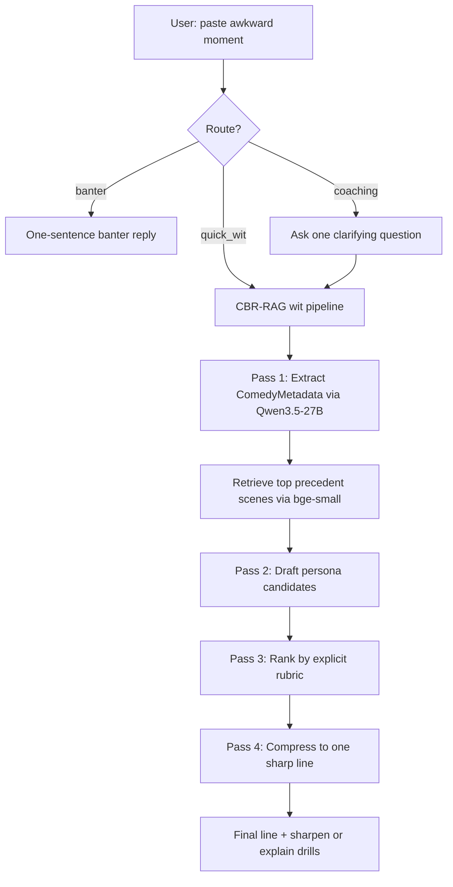
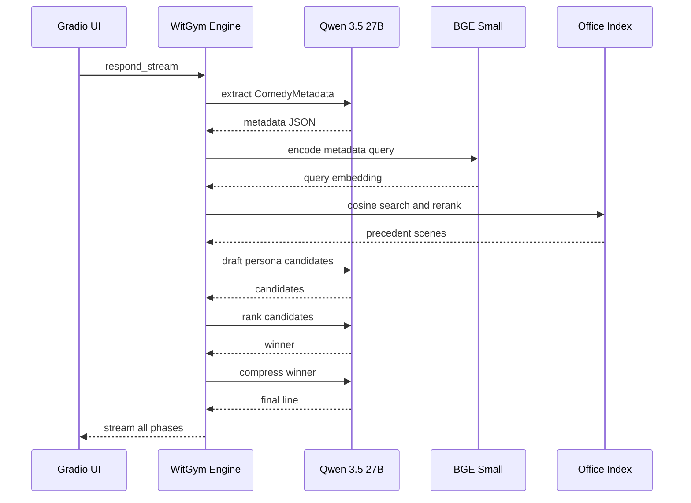

# 🎭 WitGym

**One sharp line, grounded in human precedent — then drills to sharpen it.**

WitGym is a comedy coaching engine for awkward real‑life moments. Paste what happened and it returns **one usable line** (not a paragraph), grounded in structurally similar precedent from *The Office* — then lets you iterate with drills: **sharpen it**, **different angle**, **explain why it works**.

**Live Space**: [build-small-hackathon/WitGym](https://huggingface.co/spaces/build-small-hackathon/WitGym)

### Why I built this (and why it’s not “just prompt it to be funny”)
Comedy has always been a personal interest — not just watching it, but reverse‑engineering why a line lands. Most “be funny” apps are vibes: you get a wall of text and no way to improve it.

WitGym treats wit like a skill you can train:
- **Extract the mechanism** (status games, tension, violation distance, subtext)
- **Retrieve precedent by structure** (not by topic keywords)
- **Draft a few constrained options**
- **Pick a winner with an explicit rubric**
- **Polish to one sharp line**

### Try it in 10 seconds
- Paste any awkward moment (or tap a starter chip in the sidebar).
- You’ll see the phases stream live: extract → retrieve → draft → rank → polish.
- Then iterate with drills: **sharpen it**, **different angle**, **explain why it works**.

### What makes it different
- **CBR‑RAG on comedy mechanics**: retrieval is driven by archetype, tension, violation distance, and subtext — not by copying jokes or matching keywords.
- **Small‑model friendly by design**: the intelligence is in the pipeline and the precedent index, not “bigger weights.”
- **Tournament ranking (not one-shot generation)**: the best line is selected by a fixed rubric (domain anchoring + final-clause punchline quality + sharpness).
- **Inspectable traces**: the UI shows what the system did (progressive disclosure), plus a sanitized public trace export.

### System overview (high-level)



### Algorithm sketch (pipeline-level)



### Evidence / badges
- **Sharing is Caring** (`achievement:sharing`): [public pipeline traces](https://github.com/akshay-babbar/witgym/blob/main/data/public_traces.jsonl) — sanitized JSONL (metadata, scene IDs, candidate stats, execution log; no Office dialogue text). Regenerate with `uv run python scripts/export_public_traces.py`.
- **Field Notes** (`achievement:fieldnotes`): [docs/field-notes.md](docs/field-notes.md).
- **Off‑Brand UI** (`achievement:offbrand`): custom Gradio UI + streaming trace disclosure.

### Submission links
- **Source code**: [GitHub — https://github.com/akshay-babbar/witgym](https://github.com/akshay-babbar/witgym) (built with OpenAI Codex — see co-authored commits)
- **Demo video**: [YouTube — https://youtu.be/enb5ua65RZM](https://youtu.be/enb5ua65RZM)
- **Social post**: [LinkedIn — https://www.linkedin.com/posts/akshay4b_happy-to-share-a-project-ive-been-building-ugcPost-7472401282822111232-Q_nt/](https://www.linkedin.com/posts/akshay4b_happy-to-share-a-project-ive-been-building-ugcPost-7472401282822111232-Q_nt/)
- **Validate README**: [Build Small validator](https://build-small-hackathon-field-guide.hf.space/submit)

### Technical details (grounded in the repo)
- **Engine entrypoint**: `witgym/engine.py` (`respond()` + `respond_stream()`).
- **Pass 1 extraction**: `witgym/extractor.py` → `ComedyMetadata` (JSON).
- **Retrieval**: `witgym/retriever.py` (cosine over an indexed embedding matrix; optional cross-encoder rerank).
- **Pass 2 generation + ranking**: `witgym/generator.py` (persona candidates + rubric ranker).
- **UI**: `app.py` (Gradio; streaming phases + progressive disclosure).

### Run locally

```bash
uv sync
witgym-index
export LLM_BACKEND=hf_api
export HF_TOKEN=hf_...
uv run python app.py
```

Built for the [Build Small Hackathon 2026](https://huggingface.co/build-small-hackathon) — Thousand Token Wood.
